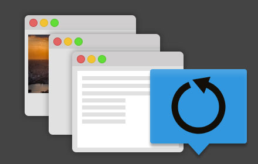

## URL carousel

Simple extension that showing websites them one by one in single tab.
Useful when you want to use chrome cast of only one tab.
For example, after locking your computer chrome cast will stop casting of whole desktop, but will continue to stream single tab. 




### Getting started

```
$ yarn install && yarn start
```

* `$ yarn build` - build for production (minified)
* `$ yarn build:dev` - build for development
* `$ yarn watch` - watch and build files for development
* `$ yarn start` - alias for `$ yarn watch`

### Chrome extension Documentation

* Manifest File Format - https://developer.chrome.com/extensions/manifest

### Building blocks
* React
* Redux
* Bootsrap CSS
